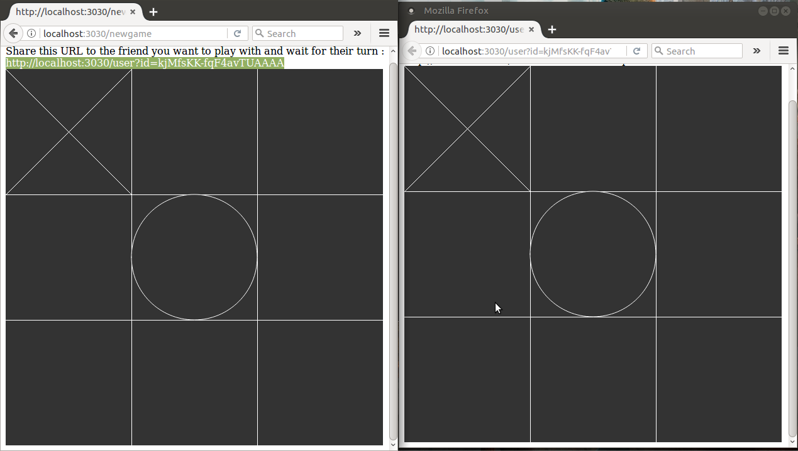
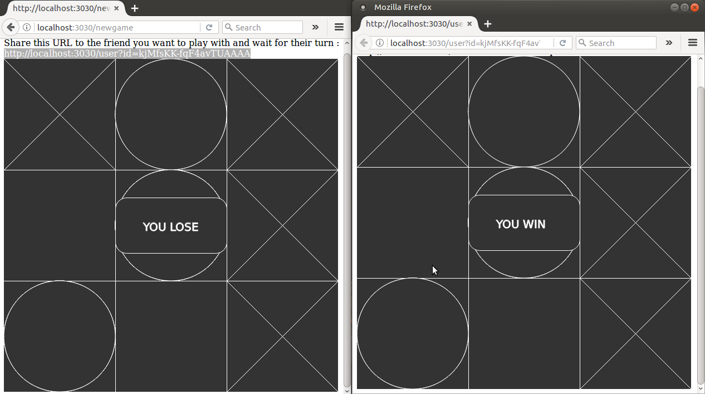
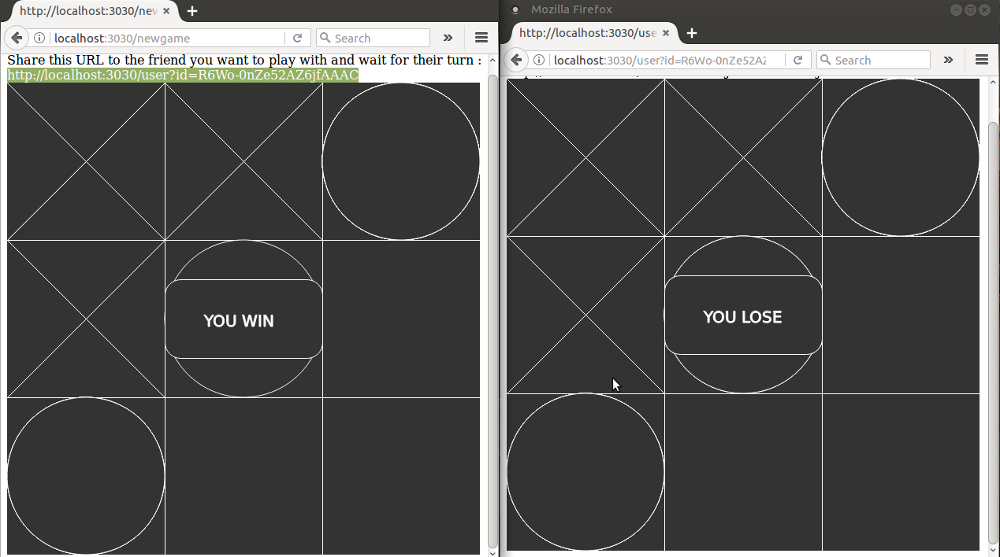

# Tic-Tac-Toe-Minimal
   

A nodeJS based multiplayer Tic-Tac-Toe game using express.js and socket.io.

## Instructions For Running the game
1. Clone this repo into the host system:
   
        git clone https://github.com/Akhilsudh/Tic-Tac-Toe-Minimal.git
2. Adjust the firewall settings to allow inbound outbound for port 3030.
3. Run this link in the browser to start a new game: 
   
        https://<HostURL>:3030/newgame
4. Share the Generated link to a friend that looks like this:
    
        https://<HostURL>:3030/user?id=<ID-Number>
5. Wait for the friend's turn

## Screenshots
After connection established

X-Wins

O-Wins

